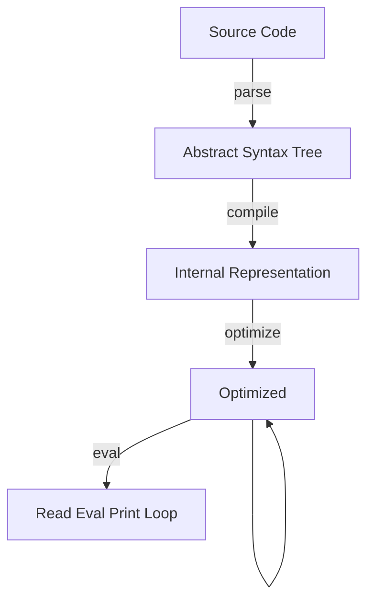

# Forth Compiler

Implemented in Rust. Compiles Forth to Web Assembly and then runs it.

**Reason for Web Assembly**: WASM is stack-based, it enforces that function stack is empty at the end of function. 
So we can use this builtin stack as Forth's *return stack*, and a seperate global variable list as *data stack*.

## Running

Build & run with: `cargo run`.

## Tests

Run all tests with: `cargo test`.

## Implementation

